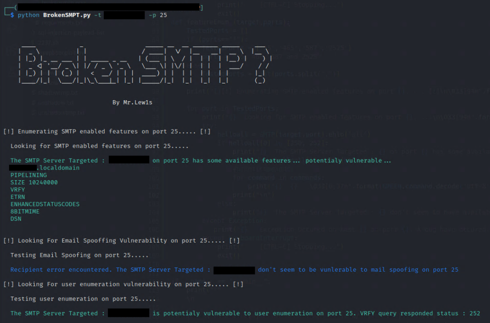

# BrokenSMTP
BrokenSMTP is a python3 BugBounty/Pentesting tool to look for common vulnerabilities on SMTP server.



Supported Vulnerability : 
* Feature Enumeration - Enumerate available features ob the SMTP Server.

* Spoofing - The ability to send an email by impersonating another user.
* User Enumeration - Looking for the possibility to enumerate users with SMTP VFRY command.
</br>

## Installation : 

```
pip install -r requirments.txt
```

## Usage : 


```
python3 BrokenSMTP.py -t SMTPServer -p Port(s)

  -h, --help            show this help message and exit
  --targets TARGETS, -t TARGETS
                        SMTP target server address or file containing SMTP servers list
  --port PORT, -p PORT  SMTP Targert port or list of port SMTP servers list. Use * for all SMTP Ports.

```